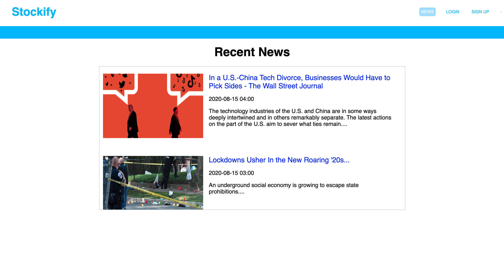
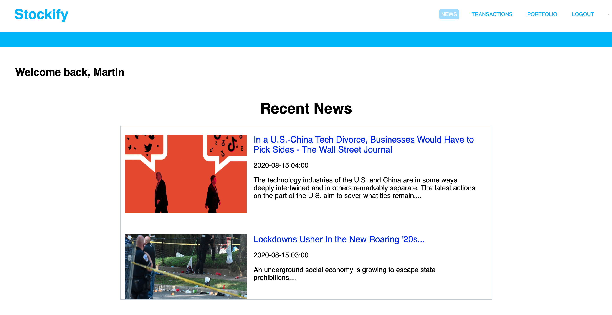
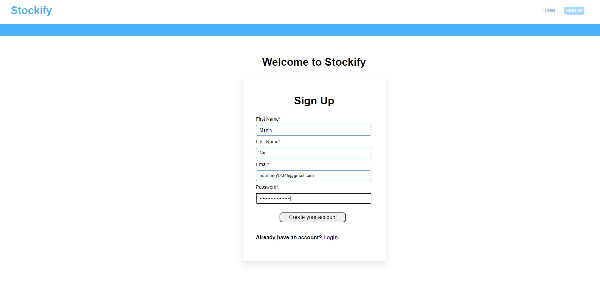
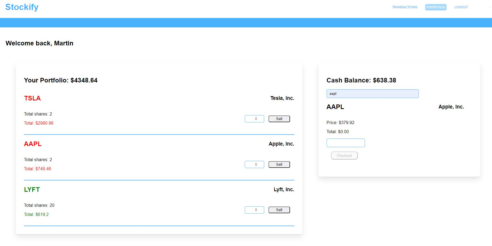
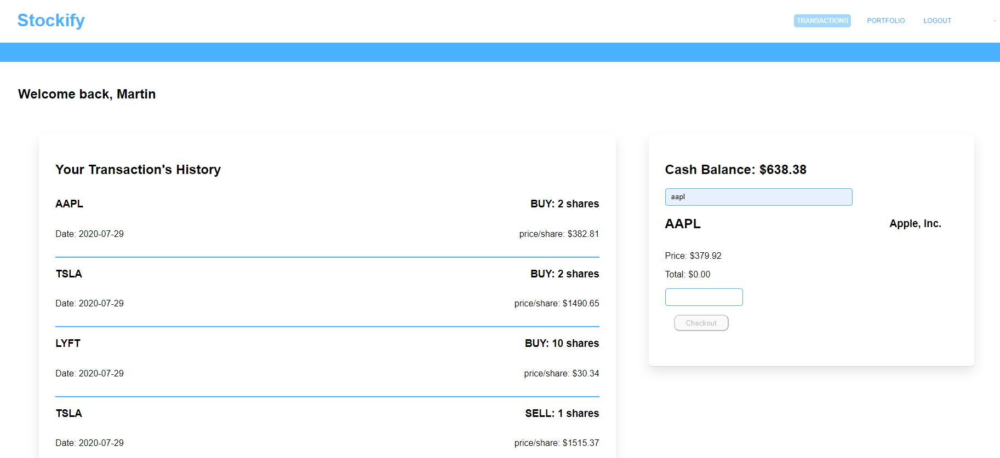

# Stockify

## Introduction

Stockify is a web application where users can trade stocks.
Users can register with a unique email, purchase/sell stocks, and audit their transactions history.
This web app is meant to simulate trading stocks without financial risks.

Please visit the following link and use the below account information. Feel free to also create an account.

Login: richierich@gmail.com
Password: Iamrich123!@

https://stockify-stocks.herokuapp.com/

## Download

Step by step guide to download repo and start the app.

Clone the project to your selected directory:

> git clone https://github.com/martin-ng/Stockify.git

Install the NPM modules

> npm install

Start the application

> npm start

Visit the following URL to use Stockify!

> http://localhost:8080/

## User Story

1.  As a new investor, I want to create a new account with my name, email, and password so that I can buy and trade stocks.

    * My cash balance will default at $5,000.
    * A user can only register once with any given email.

2.  I want to authenticate via email and password so that I can access my account to view the news, my portfolio, purchase/sell stocks.

3.  I want to be able to buy shares of stock at its current price by specifying its ticker symbol and the number of shares I want to invest in.

    * An investor can only buy whole number(integers) quantities of shares.
    * An investor can only buy shares if they have enough cash in their account for a given purchase.
    * An investor can only buy shares if the ticker symbol is valid.

4.  I want to view a list of all transactions I've made to date (trades) so that I can perform an audit.

5.  I want to view my portfolio (a list of all the stocks I own along with their current values) so that I can review my performance.

    * Current values should be based on the latest price and quantity owned for a given stock.
    * Each stock owned should only appear once.

6.  I'd like to see the font color of stock symbols and current prices in my portfolio change dynamically to indicate performance.
    * Red indicates current price is less than the day's open price.
    * Grey indicates the current price is equal to the day's open price.
    * Green indicates the current price is greater than the day's open price.

## Technologies

* Node: JavaScript runtime environment. Node's asynchronous, non-blocking, and single-threaded nature allows requests to be processed without blocking the main-tread. In addition to Node's clustering module, this makes Node-based web applications highly scalable.

* Express: Framework built on top of node to create RESTful APIs and additional middleware.

* React: JavaScript library to keep the UI and state in sync through its virtual DOM.

* Redux: State management library that allows the app to scale due to bypass React's uni-directional data flow limitation.

* PostgreSQL: Open-source relational database with ACID transactions, optimal for financial related applications that require consistency.

* Sequelize: Object relational mapping that makes SQL queries with Javascript. Sequelize has an added benefit to protect from SQL injection and create
  indexes for scalability.

* Mocha/Chai: Node-based testing frameworks used to write automated tests.

* IEX API: Stock API to get data regarding each stock tickers.

* Passport.js: Node.js authentication middleware for authentication requests.

## Design Process

1.  Stockify utilizes PostgreSQL for its data model to retain ACID transactions. Stockify's data is normalized into separate tables to elimate redundant data
    and ensuring data dependencies. Stockify's data is separated into a users, stocks, and transaction's history information table.

2.  Test-driven development was utilized to write REST APIs and the SQL-based data models. Requirements were translated into unit-tests using Mocha and Chai.
    The back-end was then written according to the requirements and refactored to ensure the test-cases pass.

3.  To protect a user's account, Stockify's back-end was written to ensure passwords are hashed using bcrypt. Security is tightened by adding a randomized salt string to
    help minimize attacks from hackers using a rainbow table.

4.  As a user, I would like to purchase and sell stocks with the latest price. Stockify makes an API call to IEX Cloud API whenever a user
    makes a post request to purchase stocks. Stockify also makes an API call to IEX Cloud API to calculate the difference between the market price and opening price.
    This data is used to indicate the portfolio's performance. A stock that is highlighted red indicates the current value
    is less than the opening value. Green on the other hand indicates the current value is higher than the opening value. Grey indicates it is neutral.

5.  Node's clustering module is implemented to increase processing power for scalability.

6.  React and Redux were used to render the front-end elements. React made it very intuitive to make Stockify a single-page application through its virtual
    DOM. Manipulating the DOM is very expensive, whereas the virtual DOM only makes changes to specific parts of the DOM. Redux complements React by storing global
    state in a central location. This facilitates passing data to deeply nested components effectively by-passing React's uni-directional data flow.

## Images

## Current Progress

1. Implementing a page that renders the most recent news using News API.

## Future Updates

1.  Create a D3-based component data to give a better visualization of a stock's performance.

2.  Implement an in-memory database such as redis to store the user's portfolio; this will drastically reduce the query time.
